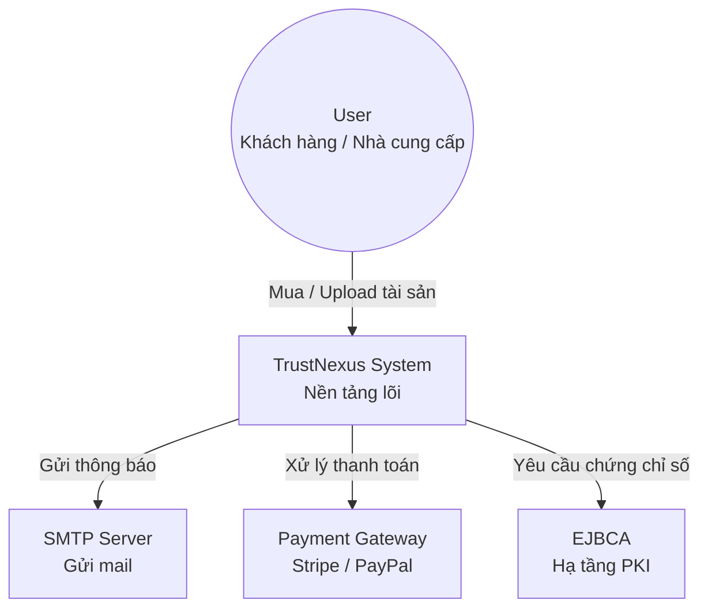
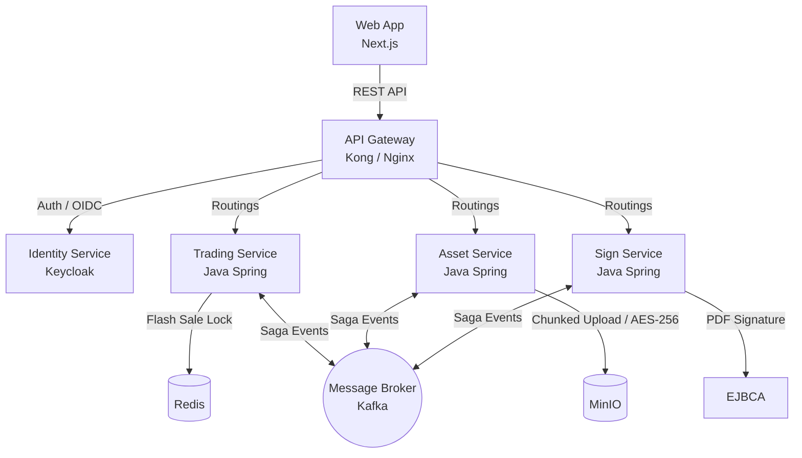

# ☁️ TrustNexus System: Technical Design Document

## 1. Tổng quan dự án (Project Overview)

**TrustNexus** là một nền tảng Marketplace dành cho tài sản số (e-books, source code, media). Hệ thống không chỉ xử lý mua bán mà còn tích hợp chặt chẽ với hạ tầng PKI (Public Key Infrastructure) để ký số hợp đồng và bảo mật tài liệu tuyệt đối.

### Mục tiêu kỹ thuật (Technical Goals)

- 🚀 **Scalability**: Kiến trúc Microservices cho phép scale độc lập các service nóng (Trading, Asset).
- 🔄 **High Consistency**: Đảm bảo tính nhất quán dữ liệu giữa các dịch vụ bằng **Saga Pattern**.
- 🔐 **Security-First**: Áp dụng Zero Trust, mTLS và mã hóa dữ liệu tại chỗ (Encryption at Rest).
- 📊 **Observability**: Giám sát toàn diện từ hạ tầng đến logic nghiệp vụ.

---

## 2. Kiến trúc hệ thống (C4 Model)

Để mô tả hệ thống này, chúng ta sẽ đi qua 2 cấp độ quan trọng nhất của C4 Model: **System Context** và **Container**.

### Cấp độ 1: System Context (Bối cảnh hệ thống)

Mô tả cách TrustNexus tương tác với người dùng và các hệ thống bên ngoài.

### Cấp độ 2: Container Diagram (Sơ đồ Container)

Đi sâu vào bên trong TrustNexus để xem các dịch vụ tương tác với nhau thế nào.

---

## 3. Các thành phần then chốt (Key Technical Designs)

### 3.1. Chiến lược xử lý Flash Sale & Concurrency

Hệ thống sử dụng **Redis-based Distributed Lock** hoặc **Lua Script** để kiểm tra tồn kho tài sản số (nếu có giới hạn số lượng). Điều này đảm bảo không có tình trạng Race Condition khi hàng nghìn User cùng nhấn "Mua" tại một thời điểm.

### 3.2. Quy trình giao dịch phân tán (Saga Pattern)

Khi một đơn hàng được tạo, luồng sự kiện qua Kafka sẽ diễn ra như sau:

1. **Trading Service**: Tạo đơn hàng trạng thái `PENDING`. Bắn sự kiện `OrderCreated` vào Kafka.
2. **Asset Service**: Nhận sự kiện, thực hiện cấp quyền truy cập (ACL) cho User. Bắn sự kiện `AssetAssigned`.
3. **Sign Service**: Nhận sự kiện, tạo hợp đồng PDF, ký số thông qua EJBCA và lưu vào kho. Bắn sự kiện `ContractSigned`.
4. **Trading Service**: Nhận sự kiện cuối cùng, cập nhật đơn hàng thành `SUCCESS`.

> **Compensating Logic (Rollback):**  
> Nếu Sign Service hoặc Asset Service lỗi, một sự kiện `Failed` (VD: `SignFailed`) sẽ được bắn ra để các service trước đó tự động hoàn tác dữ liệu (Rollback đơn hàng, thu hồi quyền truy cập).

### 3.3. Bảo mật dữ liệu (Security Schema)

- 🛂 **Authentication**: JWT (JSON Web Token) được cấp phát bởi Keycloak.
- 🚦 **Authorization**: Phân quyền dạng hạt mịn (Fine-grained) bằng Keycloak Policy Enforcer.
- 🗄️ **Data Security**: File trong MinIO được mã hóa bằng AES-256. Key mã hóa được quản lý tập trung tại **HashiCorp Vault**.

---

## 4. Kế hoạch triển khai & Vận hành (DevOps & Observability)

### 🐳 Hạ tầng Home Lab

- **Orchestration**: `Docker Compose` (cho dev) và `Docker Swarm / Kubernetes` (cho staging/prod).
- **Networking**: Cloudflare Tunnel để expose dịch vụ ra ngoài một cách an toàn.

### 📈 Giám sát (Monitoring)

- **Logs**: Tập trung về Loki thông qua Promtail.
- **Metrics**: Thu thập bằng Prometheus và hiển thị trên Grafana.
- **Tracing**: OpenTelemetry tích hợp vào các Spring Boot service để vẽ sơ đồ vết của từng Request.

---

## 5. Kết luận

Bản thiết kế này chứng minh khả năng làm chủ các công nghệ hiện đại và tư duy giải quyết các vấn đề phức tạp của một hệ thống Enterprise phân tán. Với **T-Cloud**, người phát triển không chỉ dừng lại ở việc viết code, mà đang kiến tạo nên một giải pháp kiến trúc phần mềm linh hoạt, bảo mật và bền vững.
